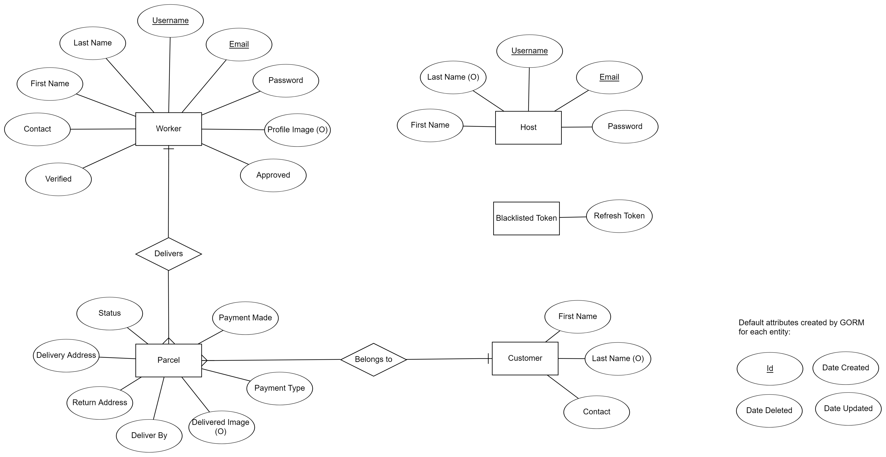

# Parcel Bustle (Backend)
[Parcel Bustle](#) is a cutting-edge courier service app designed to streamline your courier and logistic needs. With this app, you can manage parcel deliveries and track shipments in real-time with no hassle.

  
  

This app is targeted for last-mile delivery services providers, specialising in transporting good from a distribution center to the end customer's doorstep. It allows workers to save parcel details into the system either using an Optical Character Recognition (OCR) tool, or by manual input. Customers will be contactable via WhatsApp with the click of a button, while the host can manage the parcels and workers' permission through the frontend interface.

* [Frontend Repository](https://github.com/f-lsq/parcel-bustle) (React Native with Redux, Expo)
* [Backend Repository](https://github.com/f-lsq/parcel-bustle-backend) (Golang - Gin, GORM, MySQL)

## Table of Contents
1. [System Design](#system-design)
2. [Functionalities](#functionalities)
3. [Technologies Used](#technologies-used)
4. [Deployment](#deployment)
5. [References](#references)

## System Design
### Entity Relationship Diagram

### SQL Schema Diagram
Given the relationship between entities, a relational DB (in this case MySQL) would be more ideal to store the data. The schema is as shown below.

Do note that the *password* field will be hashed using [bcrypt](https://en.wikipedia.org/wiki/Bcrypt) before it is stored in the DB. 

### API Routes for Workers
Base URL for workers `http://{domain-name}.com/api/workers`.
| Endpoint | Method | Description | Request Body | Response | Authentication Response |
|----------|--------|-------------|--------------|----------|-------------------------|
| `/` | GET | Get a list of all workers, returned as JSON |   | Status 200 - returns data of all workers  Status 500 - returns an error message |   |
| `/:workerId` | GET | Get a worker by their ID, returning worker data as JSON |   | Status 200 - returns data of the specific worker  Status 404 - returns an error message indicating that the worker is not found  Status 500 - returns an error message |   |
| `/` | POST | Creates a new worker from request data sent as JSON | {  &emsp;"username": string,  &emsp;"email": string,  &emsp;"password": string,  &emsp;"confirm_password": string,  &emsp;"name_first": string,  &emsp;"name_last": string,  &emsp;"contact": string,  &emsp;"profile_image": string   } | Status 200 - returns a success message  Status 400 - returns an error message indicating any missing required fields  Status 500 - returns an error message |   |
| `/` | PUT | Update data of a specific worker | {  &emsp;"username": string,  &emsp;"email": string,  &emsp;"password": string,  &emsp;"confirm_password": string,  &emsp;"name_first": string,  &emsp;"name_last": string,  &emsp;"contact": string,  &emsp;"profile_image": string   } | Status 200 - returns data of the updated worker  Status 400 - returns an error message indicating any missing or invalid fields  Status 404 - returns an error message indicating that the worker is not found  Status 500 - returns an error message | Status 401 - returns an error message requiring login  Status 403 - returns an error message indicating an invalid access token |
| `/:workerId` | DELETE | Delete a specific worker |  | Status 200 - returns data of the deleted worker  Status 404 - returns an error message indicating that the worker is not found  Status 500 - returns an error message | Status 401 - returns an error message requiring login  Status 403 - returns an error message indicating an invalid access token |

## Functionalities

## Technologies Used
### Frontend
* [React Native](https://reactnative.dev/)
* [Expo](https://expo.dev/)

### Backend
* [Gin](https://gin-gonic.com/docs/) - Server environment. [GORM](https://gorm.io/)
* [MySQL](https://www.mysql.com/)/[PostgresSQL](https://www.postgresql.org/) - Database management

## Deployment
### Live Links
* [React Native Frontend](#)
* [Gin Backend](#)

### Test Accounts
| Account Type | Name | Email | Password | 
|--------------|------|-------|----------|
| Worker       | [Mulan Hua](https://disney.fandom.com/wiki/Fa_Mulan) | mulanhua@parcelbustle.com    | mulanhua123@      |
| Worker       | [Shang Li](https://disney.fandom.com/wiki/Li_Shang)   | shangli@parcelbustle.com    | shangli123@      |
| Worker       | [Chi Fu](https://disney.fandom.com/wiki/Chi-Fu)   | chifu@parcelbustle.com    | shangli123@      |
| Host         | [Yu Shan](https://en.wikipedia.org/wiki/Li_Shang)      | shanyu@parcelbustle.com    | *Not provided* |

## References
## References
1. [Marcus, K. (2024 January 18). Go ORMs in 2024.](https://encore.dev/resources/go-orms)
